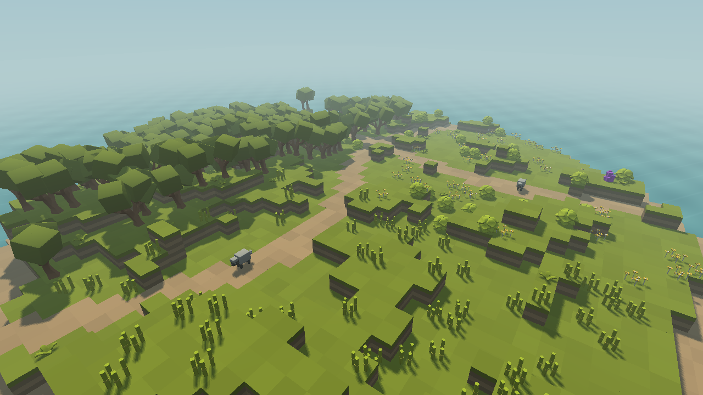

<h1 align="center">SnapBench</h1>

<p align="center">
  <strong>A wildlife photography benchmark for vision-language models.</strong><br>
  Inspired by Pokémon Snap. Piloted by AI.
</p>

<p align="center">
  
  
  
  
</p>

<p align="center">
  <a href="#quick-start">Quick start</a> &nbsp;·&nbsp;
  <a href="#run-benchmarks">Benchmarks</a> &nbsp;·&nbsp;
  <a href="#results">Results</a> &nbsp;·&nbsp;
  <a href="#development">Development</a>
</p>

<p align="center">
  
  <br>
  <sub>Mariner Island · Three animals to find · One drone camera</sub>
</p>

## The task

A model pilots a drone around Mariner Island and photographs three animals.
Each observation pairs a first-person image with the drone's pose; the world
pauses while the model decides its next move.

| Explore | Frame | Photograph |
| --- | --- | --- |
| Navigate woodland, meadows, and coastal paths. | Adjust position, altitude, and camera tilt. | Capture a visible animal at sufficient image size. |

**Under the hood:** Zig/raylib runs the world, a Rust controller calls models
through OpenRouter, and Python runs the benchmark suite.

## Results

> **Results coming soon.**

## Quick start

| Tool | Requirement |
| --- | --- |
| Zig | 0.16.0 |
| Rust | 2024 edition support |
| Python | 3.11+ with uv |
| Graphics | OpenGL 3.3 or newer |

Tested on **macOS with Apple Silicon**. Run commands from the repository root
so assets can be found.

### Fly it yourself

No API key needed. Change `SEED` to explore another layout.

```sh
git clone https://github.com/kxzk/snapbench.git
cd snapbench
make sim SEED=42
```

<details>
<summary><strong>Flight controls</strong></summary>

| Control | Action |
| --- | --- |
| <kbd>WASD</kbd> / arrow keys | Fly relative to heading |
| <kbd>Space</kbd> / <kbd>Shift</kbd> (left) | Ascend / descend |
| <kbd>Q</kbd> / <kbd>E</kbd> | Turn |
| <kbd>I</kbd> / <kbd>K</kbd> | Tilt the camera |
| <kbd>Tab</kbd> | Switch chase / photography camera |
| <kbd>P</kbd> | Photograph a framed animal |
| <kbd>R</kbd> | Reset and return to manual control |
| <kbd>F3</kbd> | Toggle diagnostics |
| <kbd>Esc</kbd> | Close |

</details>

### Let a model fly

Leave the simulation open. In a second terminal, from the repository root:

```sh
export OPENROUTER_API_KEY="your-openrouter-api-key"
make drone
```

The default controller uses **Gemini 3 Flash Preview**. To choose a model and
limit the run to 50 decisions:

```sh
cargo run --release --manifest-path llm_drone/Cargo.toml -- \
  --model openai/gpt-5.6-luna --max-iterations 50
```

## Run benchmarks

Close any manually running simulation first. Set `OPENROUTER_API_KEY` in the
terminal running the benchmark. The runner builds the simulator and controller,
then starts a simulation for each model/seed pair.

```sh
# All configured models; skip model/seed pairs with existing results
make bench

# One model
uv run bench/bench_runner.py --model google/gemini-3.8-flash

# Rerun that model, replacing its existing results as each run finishes
uv run bench/bench_runner.py --model google/gemini-3.8-flash --force
```

| File or directory | Purpose |
| --- | --- |
| [bench/models.toml](bench/models.toml) | Model lineup and prices per million tokens |
| `data/results-v2.csv` | New benchmark results |
| `.snapbench/replays/` | Controller replay records |
| `data/results.csv` | Historical results from the original scenario |

## Development

```sh
make test   # Zig, Rust, and Python regression tests
make check  # Formatting, lints, and Python types

# With a simulation running: verify a full flight and replay it
make verify
make replay REPLAY=.snapbench/verification.jsonl
```

These checks require no model API calls.

- [Simulation guide](docs/simulation-v2.md) — Agent API, photography rules,
  deterministic replay, and profiling.
- [Archived README](docs/archive/README-2026-09-12.md) — Previous write-up and
  historical results.

---

## Credits

- Drone by NateGazzard, [CC BY](https://creativecommons.org/licenses/by/3.0/),
  via [Poly Pizza](https://poly.pizza/m/DNbUoMtG3H).
- Cube World Kit by Quaternius, via
  [Poly Pizza](https://poly.pizza/bundle/Cube-World-Kit-DwDr8493Fw).
- Manrope by the Manrope Project Authors, [SIL Open Font License](assets/fonts/OFL.txt).
  The bundled font is a static weight-550 instance of the
  [Google Fonts source](https://github.com/google/fonts/tree/main/ofl/manrope).
