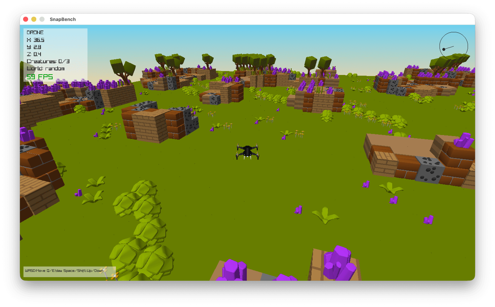
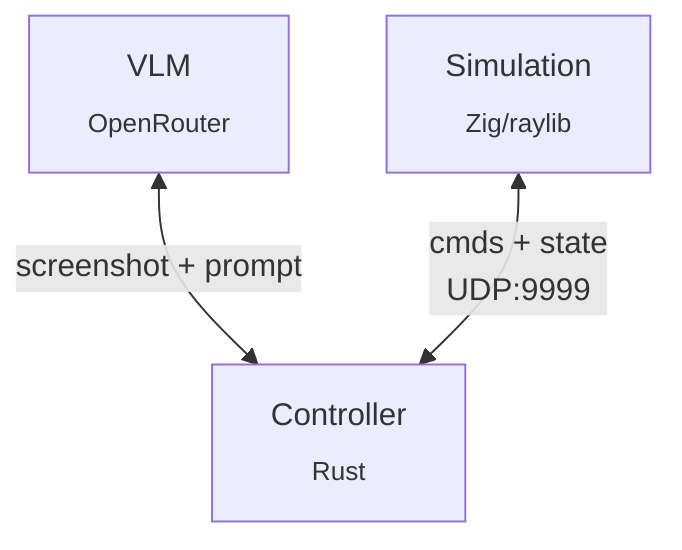

<h3 align="center">SnapBench</h3>

> A VLM pilots a drone through a 3D world to locate and identify creatures.
> Inspired by [Pokémon Snap](https://en.wikipedia.org/wiki/Pok%C3%A9mon_Snap) (1999).

### Architecture

**Simulation** — Procedural terrain, spawned animals (cat/dog/pig/sheep), drone physics, collision detection. Accepts 8 movement commands + `identify` + `screenshot`.

**Controller** — Captures frames, builds prompts with position/state, parses VLM responses into command sequences.

**Task** — Find and identify 3 creatures. `identify` succeeds within 5 units of a creature.

