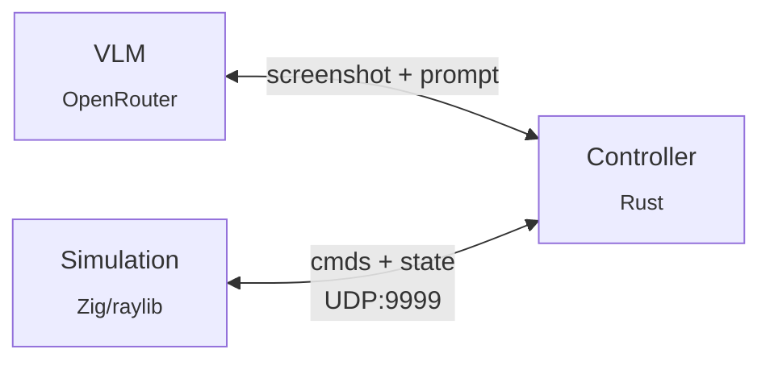

<h3 align="center">SnapBench</h3>

> A VLM pilots a drone through a 3D world to locate and identify creatures.
>
> Inspired by [Pokémon Snap](https://en.wikipedia.org/wiki/Pok%C3%A9mon_Snap) (1999).

 

### Architecture

### Overview

The simulation generates procedural terrain and spawns creatures (cat, dog, pig, sheep) for the drone to discover. It handles drone physics and collision detection, accepting 8 movement commands plus `identify` and `screenshot`. The Rust controller captures frames from the simulation, constructs prompts enriched with position and state data, then parses VLM responses into executable command sequences. The objective: locate and successfully identify 3 creatures, where `identify` succeeds when the drone is within 5 units of a target.

 
