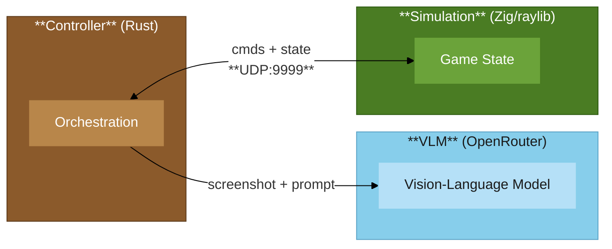
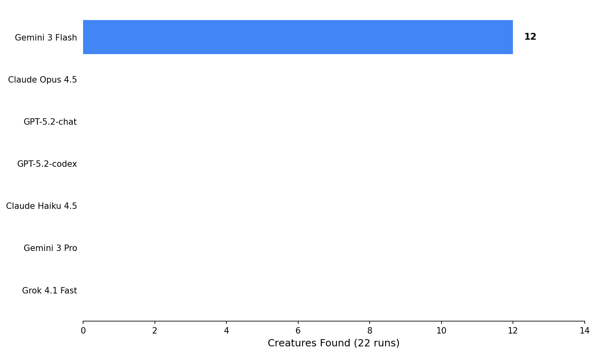
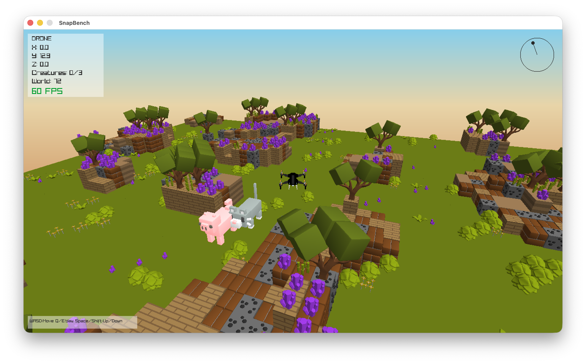

<h3 align="center">SnapBench</h3>

> Inspired by [Pokémon Snap](https://en.wikipedia.org/wiki/Pok%C3%A9mon_Snap) (1999). VLM pilots a drone through 3D world to locate and identify creatures.

<p>  </p>

### Architecture



### Island photography scenario

The default `island-photo-v2` scenario is a wildlife photography task: fly over an
island, frame three animals in the drone camera, and document each species. The
world has connected habitats and paths, soft sunlight shadows, atmospheric fog,
water, wind, animated animals, and a camera that avoids obstacles. `TAB` switches
between chase and photography cameras; `P` records a framed subject.

Simulation runs at a fixed 120 Hz. A versioned agent API pairs every observation
with its pose and tick, pauses between actions, and supports deterministic replay.
See [the API and scenario guide](docs/simulation-v2.md) for rules, controls, and
examples. No paid API key is needed to play or run `make verify`.

### Historical results (original proximity scenario)

| Model | Creatures Detected |
|-------|--------------------|
| moonshotai/kimi-k2.5 | 0 |

### Overview

The Zig simulation handles terrain, movement, collision, photography, and rendering.
The Rust controller sends bounded actions over loopback UDP, receives camera images
with their exact state, and asks a VLM for the next commands. Photography requires
framing, visibility, and sufficient image size. `--scenario legacy` retains the
original terrain generator and proximity rules for comparison; the narrative and
results below describe that older task.

<br>

https://github.com/user-attachments/assets/37903246-a5ae-4e83-87c6-c099198c8724

<br>

## Gotta catch 'em all?

I gave 7 frontier LLMs a simple task: pilot a drone through a 3D voxel world and find 3 creatures.

Only one could do it.



Is this a rigorous benchmark? No. However, it's a reasonably fair comparison - same prompt, same seeds, same iteration limits. I'm sure with enough refinement you could coax better results out of each model. But that's kind of the point: out of the box, with zero hand-holding, only one model figured out how to actually *fly*.

## Why can't Claude look down?

The core differentiator wasn't intelligence - it was **altitude control**. Creatures sit on the ground. To identify them, you need to descend.

- **Gemini Flash**: Actively adjusts altitude, descends to creature level, identifies
- **GPT-5.2-chat**: Gets close horizontally but never lowers
- **Claude Opus**: Attempts identification 160+ times, never succeeds - approaching at wrong angles
- **Others**: Wander randomly or get stuck

This left me puzzled. Claude Opus is arguably the most capable model in the lineup. It *knows* it needs to identify creatures. It tries - aggressively. But it never adjusts its approach angle.

## The two-creature anomaly

Run 13 (seed 72) was the only run where any model found 2 creatures. Why? They happened to spawn near each other. Gemini Flash found one, turned around, and spotted the second.



In most other runs, Flash found one creature quickly but ran out of iterations searching for the others. The world is big. 50 iterations isn't a lot of time.

## Bigger ≠ better

This was the most surprising finding. I expected:
- Claude Opus 4.5 (most expensive) to dominate
- Gemini 3 Pro to outperform Gemini 3 Flash (same family, more capability)

Instead, the cheapest model beat models costing 10x more.

What's going on here? A few theories:

1. **Spatial reasoning doesn't scale with model size** - at least not yet
2. **Flash was trained differently** - maybe more robotics data, more embodied scenarios?
3. **Smaller models follow instructions more literally** - "go down" means go down, not "consider the optimal trajectory"

I genuinely don't know. But if you're building an LLM-powered agent that needs to navigate physical or virtual space, the most expensive model might not be your best choice.

## Color theory, maybe

Anecdotally, creatures with higher contrast (gray sheep, pink pigs) seemed easier to spot than brown-ish creatures that blended into the terrain. A future version might normalize creature visibility. Or maybe that's the point - real-world object detection isn't normalized either.

## Prior work

Before this, I tried having LLMs pilot a [real DJI Tello drone](https://github.com/kxzk/tello-bench).

Results: it flew straight up, hit the ceiling, and did donuts until I caught it. (I was using Haiku 4.5, which in hindsight explains a lot.)

The Tello is now broken. I've ordered a BetaFPV and might get another Tello since they're so easy to program. Now that I know Gemini Flash can actually navigate, a real-world follow-up might be worth revisiting.

## Rough edges

This is half-serious research, half "let's see what happens."

- The simulation has rough edges (it's a side project, not a polished benchmark suite)
- One blanket prompt is used for all models - model-specific tuning would likely improve results
- The feedback loop is basic (position, screenshot, recent commands) - there's room to get creative with what information gets passed back
- Iteration limits (50) may artificially cap models that are slower but would eventually succeed

## Try it yourself

### Prerequisites

| Tool | Version | Install |
|------|---------|---------|
| Zig | 0.16.0 | [ziglang.org/download](https://ziglang.org/download/) |
| Rust | stable (2024 edition) | [rust-lang.org/tools/install](https://rust-lang.org/tools/install/) |
| Python | ≥3.11 | [python.org](https://www.python.org/) |
| uv | latest | [docs.astral.sh/uv](https://docs.astral.sh/uv/getting-started/installation/) |

You'll also need an [OpenRouter](https://openrouter.ai/) API key.

### Setup

```bash
gh repo clone kxzk/snapbench
cd snapbench

# set your API key
export OPENROUTER_API_KEY="sk-or-..."
```

### Running the simulation manually

```bash
# terminal 1: start the simulation (with optional seed)
zig build run -Doptimize=ReleaseFast -- 42
# or
make sim

# terminal 2: start the drone controller
cargo run --release --manifest-path llm_drone/Cargo.toml -- --model google/gemini-3-flash-preview
# or
make drone
```

### Running the benchmark suite

```bash
# runs all models defined in bench/models.toml
uv run bench/bench_runner.py
# or
make bench
```

New results are saved to `data/results-v2.csv`, including the scenario, simulation
ticks, and replay path. Historical `data/results.csv` remains separate.
Use `uv run bench/bench_runner.py --force` to rerun existing model/seed pairs.
Each result replaces only its matching pair through an atomic file replacement;
an interrupted rerun keeps results for pairs that have not finished. Controller
checkpoints are also replaced atomically and recovered after timeouts or errors.

### Development and performance

The simulation uses Zig 0.16.0 and pinned raylib 6.0. Run commands from the
repository root so the simulation can find `assets/`. The verified platform is
macOS on Apple Silicon; the renderer requires OpenGL 3.3 or newer.

```bash
make test                 # Zig, Rust, and Python regression tests; no API calls
make check                # formatting, Clippy, Ruff, and strict Python types
make profile SEED=42      # 1200 uncapped frames, after 120 warmup frames

# Follow display refresh with vsync (default)
zig build run -Doptimize=ReleaseFast -- 42

# Explicit software cap, or 0 for uncapped rendering
zig build run -Doptimize=ReleaseFast -- 42 --fps 120
```

`--profile N` prints average FPS, frame-time percentiles, maximum frame time,
CPU work time, and the number of frames over 16.67 ms, then exits. Keyboard input
is disabled during profiling to make repeated measurements comparable; UDP
commands remain available for scripted flight tests. Frame times include
presentation and pacing. CPU work time excludes presentation and is not a GPU
timing measurement.

The renderer keeps compact instance data on the GPU, skips enclosed blocks, and
culls 8×8-cell chunks against the camera frustum. The simulation uses fixed steps,
interpolated rendering, exponential movement smoothing, and swept collision.
Observations use a separate 1280×720 camera without HUD hints. A GPU pixel buffer
and fence defer readback until ready; a worker flips and encodes the PNG.

UDP listens on `127.0.0.1:9999`. The Rust controller uses the JSON v2 protocol.
Plain text commands remain for manual diagnostics, and exact nearest-creature
distance is exposed only by the legacy scenario. Close a manually running
simulation before starting the benchmark suite. See [the original modernization
audit](docs/modernization-audit.md) and [the v2 guide](docs/simulation-v2.md).

## Where this could go

- **Model-specific prompts**: Tune instructions to each model's strengths
- **Richer feedback**: Pass more spatial context (distance readings, compass, minimap?)
- **Multi-agent runs**: What if you gave each model a drone and made them compete?
- **Extended iterations**: Let slow models run longer to isolate reasoning from speed
- **Real drone benchmark**: Gemini Flash vs. the BetaFPV
- **Pokémon assets**: Found [low-poly Pokémon models](https://poly.pizza/l/Bm4vionqpU) on Poly Pizza—leaning into the Pokémon Snap inspiration
- **World improvements**: Larger terrain, better visuals, performance optimizations

<br>

## Attribution

- Drone by NateGazzard [CC-BY](https://creativecommons.org/licenses/by/3.0/) via [Poly Pizza](https://poly.pizza/m/DNbUoMtG3H)
- Cube World Kit by Quaternius via [Poly Pizza](https://poly.pizza/bundle/Cube-World-Kit-DwDr8493Fw)
- Manrope by the Manrope Project Authors, [SIL Open Font License](assets/fonts/OFL.txt).
  The bundled font is a static weight-550 instance of the [Google Fonts source](https://github.com/google/fonts/tree/main/ofl/manrope).

*Donated to [Poly Pizza](https://poly.pizza) to support the platform.*

<br>
